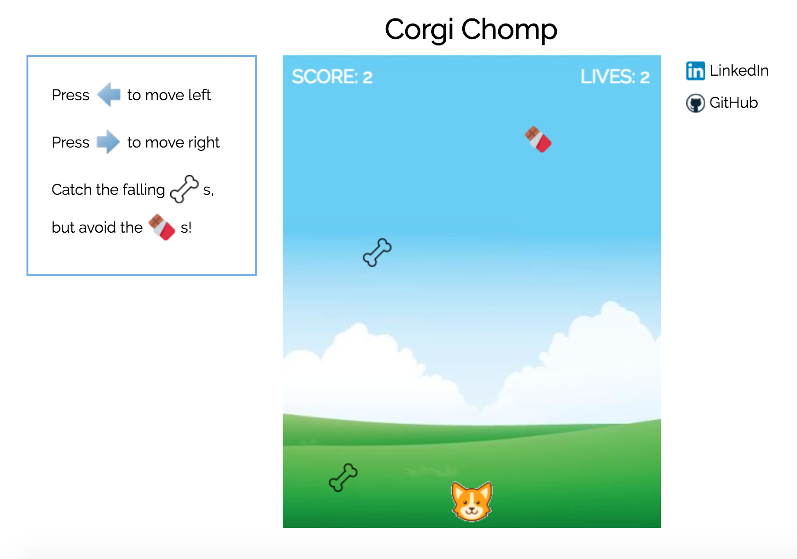

# CorgiChomp

[CorgiChomp](https://joycechau.github.io/CorgiChomp/) is an adorable spin on a classic item catcher browser game.  The player moves the corgi left and right to catch the falling bones, earning 1 point for every bone caught.  The player must avoid the falling chocolate (chocolate makes dogs sick! :mask:).  The player loses 1 life for every chocolate caught, and the game ends when all 3 lives are gone.  The object of the game is to score has many points as possible before losing all 3 lives.  

## Project Design

CorgiChomp was built in 2-3 days.  

A [proposal](https://github.com/joycechau/CorgiChomp/blob/master/docs/js-proposal.md) was drafted to help provide an implementation timeline during the development process.



## Architecture and Technologies

The project was implemented with the following technologies:

* Vanilla JavaScript, Keymaster library, and ``` jquery ``` for overall structure, game logic, and DOM manipulation  
* HTML5 Canvas for rendering
* Webpack to bundle and serve up the various scripts

## Technical Implementation

1 day was dedicated to researching HTML5 Canvas.  

Snippet of overall game-drawing logic:

```
draw(ctx) {
  ctx.clearRect(0, 0, Game.DIM_X, Game.DIM_Y);
  this.corgi.draw(ctx);
  this.checkCollisions();
  this.drawScore(this.ctx);
  this.drawLives(this.ctx);
  this.checkGameOver(this.ctx);
}
```

## Future Implementations

Additional features to add include:
* Creating diverse levels (randomize drop speeds, increase/decrease amount of falling items)
* Variety of "power" items (ie hearts to increase life count, sun to melt and remove all chocolates from the screen for a given period of time, shoes to make the corgi move faster)
* Allowing player to select difficulty level
* Integrating audio
